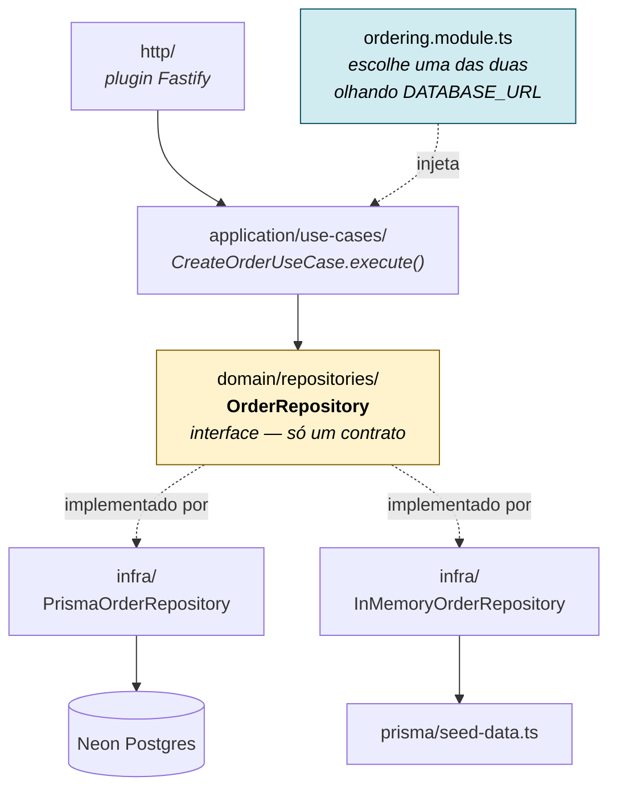

<div align="center">

# 🥘 Mandaí

**Peça comida e retire no balcão.** Sem entrega, sem cadastro, sem pagamento online.

[](https://nextjs.org)
[](https://react.dev)
[](https://fastify.dev)
[](https://prisma.io)
[](https://typescriptlang.org)
[](https://neon.tech)

</div>

---

## O que é

Você escolhe um restaurante perto, monta o pedido, confirma com seu nome e recebe um
código curto — `MA-7K2D` — mais um QR code. Chega no balcão, mostra o código, pega a comida.

É um **projeto didático de arquitetura**, construído a partir de um handoff de design de
13 telas em alta fidelidade. O objetivo não é só que funcione: é que dê para **abrir
qualquer arquivo e entender por que ele está ali** — e, quando a resposta não estiver no
código, ela está registrada em `docs/`.

## Comece em 2 minutos

O backend sobe **sem banco de dados nenhum**. Se `DATABASE_URL` não existir, ele usa
repositórios em memória alimentados pelo mesmo arquivo de seed do Postgres. Você clona e roda.

```bash
# terminal 1 — API em :3001
cd apps/api && npm install && npm run dev

# terminal 2 — site em :3000
cd apps/web && npm install && npm run dev
```

Abra <http://localhost:3000> e siga o fluxo: home → restaurante → adicionar item → sacola → finalizar.

```bash
curl localhost:3001/api/health
# {"status":"ok","database":"in-memory"}
```

<details>
<summary><b>Com Postgres de verdade (opcional)</b></summary>

Crie um projeto gratuito no [Neon](https://neon.tech) e use a connection string **direta**
— a com `-pooler` no host não serve para migrations.

```bash
cd apps/api
cp .env.example .env      # cole sua DATABASE_URL
npm run db:generate
npx prisma migrate dev --name init
npm run db:seed
npm run dev
```

O `health` passa a responder `"database":"postgres"`. **Nenhuma linha de código muda** —
quem troca a implementação é a factory em `ordering.module.ts`.

</details>

## A ideia central da arquitetura

O conceito que o projeto inteiro existe para demonstrar: **a interface mora no domínio, a
implementação mora na infraestrutura**. O caso de uso não sabe — e não pode saber — se está
falando com o Postgres ou com um array em memória.



A seta pontilhada é a inversão de dependência: `domain/` **não importa Fastify nem Prisma**
em nenhum arquivo — e isso é verificado, não prometido.

## Estrutura

```
apps/
├── api/                         # Fastify + Prisma
│   ├── prisma/
│   │   ├── schema.prisma        # 9 tabelas, espelha docs/erd.md
│   │   └── seed-data.ts         # fonte única: alimenta Postgres E memória
│   └── src/modules/ordering/    # um único bounded context
│       ├── domain/              # entidades, VO Money, interfaces de repositório
│       ├── application/         # casos de uso: classes com execute(input)
│       ├── infra/               # 2 implementações por repositório
│       ├── http/                # rotas Fastify + validação zod
│       └── ordering.module.ts   # injeção de dependência manual, explícita
│
└── web/                         # Next.js 15 App Router
    └── src/
        ├── app/                 # rotas (Server Components por padrão)
        ├── modules/             # restaurants · cart · orders · search
        ├── shared/              # header, footer, wrapper de fetch, helpers
        └── styles/              # tokens.css e app.css do handoff, byte a byte

docs/                            # o "porquê" do projeto
design_handoff_mandai_web/       # as 13 telas originais (read-only)
```

Não há `package.json` na raiz e não há workspaces. Cada app se instala e builda sozinho
— [ADR-0001](docs/adr/0001-monorepo-apps-sem-workspaces.md) explica a escolha.

## API

Dinheiro sempre em **centavos inteiros**. Erro no formato `{ statusCode, error, message }`.

| Método | Rota | Serve |
|---|---|---|
| `GET` | `/api/health` | diz se está em `postgres` ou `in-memory` |
| `GET` | `/api/restaurants?category=&sort=` | home e listagem por categoria |
| `GET` | `/api/restaurants/:slug` | cardápio completo, com modificadores |
| `GET` | `/api/search?q=` | busca restaurantes e pratos |
| `POST` | `/api/orders` | cria o pedido e devolve o código `MA-XXXX` |
| `GET` | `/api/orders/:code` | tela de confirmação |
| `POST` | `/api/coupons/validate` | valida cupom antes de finalizar |

`POST /api/orders` **revalida tudo no servidor** e nunca confia no cliente: disponibilidade
de cada item, `minSelect`/`maxSelect` de cada grupo de escolha, restaurante aberto, sacola de
um restaurante só — e recalcula subtotal, desconto e total a partir do banco.

Contrato completo com exemplos reais em [`docs/qa/contrato-api.md`](docs/qa/contrato-api.md).

## Telas

| Rota | Tela do handoff |
|---|---|
| `/` | Home |
| `/categoria/[slug]` | Categoria |
| `/busca?q=` | Busca (com e sem resultado) |
| `/restaurante/[slug]` | Cardápio · modal de item · fechado · esgotado |
| `/sacola` | Sacola · sacola vazia · checkout |
| `/pedido/[codigo]` | Pedido confirmado, com QR |

Para ver o design original, abra `design_handoff_mandai_web/Mandai - Hi-fi Web.html` no
navegador. Duplo clique numa tela abre em foco; `Esc` sai.

## A documentação é o produto

Este é o diferencial do repositório. Toda decisão não óbvia tem um registro escrito, com o
raciocínio — não só a conclusão.

| Onde | O que responde |
|---|---|
| [`docs/adr/`](docs/adr/) | **16 ADRs.** Por que Fastify, por que sem workspaces, por que `slug` na URL, por que o QR não é assinado. Imutáveis: decisão que muda ganha ADR novo. |
| [`docs/erd.md`](docs/erd.md) | Modelo de domínio em Mermaid, com o porquê de cada escolha — inclusive do que **não** virou tabela. |
| [`docs/user-stories/`](docs/user-stories/) | **10 histórias** com critérios de aceite. |
| [`docs/decisoes-produto.md`](docs/decisoes-produto.md) | **26 decisões de produto**, com a copy exata de cada estado. |
| [`docs/qa/`](docs/qa/) | Contrato de API, auditoria de conformidade arquitetural e as dúvidas em aberto de cada dev. |
| [`docs/release/`](docs/release/) | Relatório de release, incluindo o que deu errado no caminho. |

> **Regra de manutenção:** commit que altera `prisma/schema.prisma` altera `docs/erd.md`
> no mesmo commit. Documento de modelo desatualizado é pior que documento ausente — é
> confiável até o momento em que engana.

## Como isto foi verificado

Não é "compila, então funciona":

- `tsc --noEmit`, `build` e `lint` limpos nos dois apps, a partir de `npm ci` do lockfile
- fluxo completo exercitado com `curl` nos dois modos — memória e Postgres real
- pedido criado de verdade, e **lido de volta por outro processo depois de um restart** —
  é o que separa persistência de estado em memória
- auditoria de conformidade arquitetural com **zero desvios abertos**
  ([relatório](docs/qa/conformidade-arquitetura.md))

## O que ficou de fora, de propósito

Sem login, sem pagamento online, sem responsividade mobile, sem i18n, sem tema escuro,
sem testes E2E e sem observabilidade. Nenhum é esquecimento — cada um está registrado em
[`ARQUITETURA.md`](ARQUITETURA.md) §11 e é candidato natural a exercício de extensão.

O projeto também evita, deliberadamente, abstrações que caberiam num sistema maior: **sem
Result pattern, sem eventos de domínio, sem CQRS, sem classes `Mapper`, sem múltiplos
bounded contexts.** O critério está em `ARQUITETURA.md` §8 e vale como resumo do repo:

> Se uma abstração precisa de explicação antes de ser entendida, ela não pertence aqui.

## É iniciante? Comece por aqui

1. **Rode o projeto** com o passo a passo acima. Não precisa de banco.
2. Abra [`docs/user-stories/US-01-descobrir-restaurantes.md`](docs/user-stories/US-01-descobrir-restaurantes.md)
   — é a menor história completa, e mostra como escopo vira código.
3. Siga um pedido inteiro pelo backend, nesta ordem:
   `http/ordering.routes.ts` → `application/use-cases/create-order.ts` →
   `domain/repositories/order.repository.ts` → `infra/prisma-order.repository.ts`.
   São quatro arquivos e o caminho fica claro.
4. Leia [`ADR-0011`](docs/adr/0011-repositorio-em-memoria-como-segunda-implementacao-de-infra.md).
   É o ADR que explica por que o projeto roda sem banco — e por que isso é arquitetura, não gambiarra.
5. Mude alguma coisa: adicione um restaurante em `prisma/seed-data.ts` e veja aparecer na home.

## Licença e origem

Material educacional. O design vem do handoff em `design_handoff_mandai_web/`, que é
**read-only** — copie de lá, nunca edite lá. As fotos são do Unsplash.
