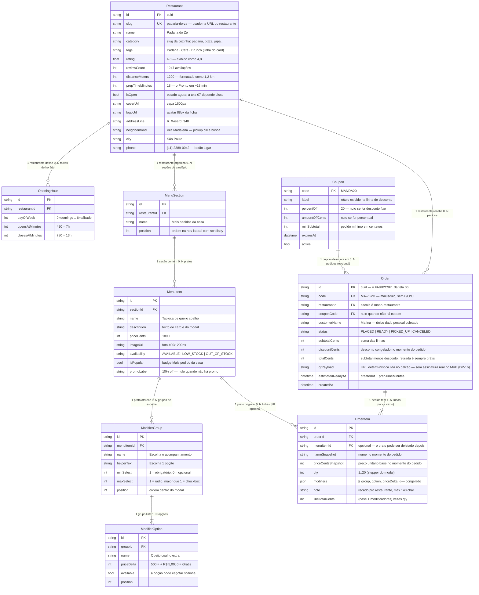

# ERD — Mandaí

Modelo de domínio do Mandaí (pedidos para retirada no balcão). Espelha
`apps/api/prisma/schema.prisma`, mas vive como **documento de domínio independente**:
é aqui que a discussão acontece antes de mexer no schema.

> **Regra de manutenção:** todo commit que altera `prisma/schema.prisma` altera este
> arquivo no mesmo commit.

Valores monetários são sempre **inteiros em centavos** (`priceCents`, `totalCents`).
Nunca `float` — `R$ 18,90` é `1890`.

---

## Diagrama

---

## Por que assim

### Snapshots em `OrderItem` (a decisão central)

`OrderItem` não confia no `MenuItem` para exibir o pedido. Ele copia `nameSnapshot`,
`priceCentsSnapshot` e o array `modifiers` no instante do checkout.

O motivo é que **um pedido é um fato histórico, não uma consulta ao cardápio de agora**.
O restaurante reajusta o preço da tapioca na terça; o pedido de segunda tem que continuar
mostrando `R$ 18,90` e somando o mesmo total. Sem snapshot, abrir o pedido `MA-7K2D` uma
semana depois reescreveria o passado — e o valor mostrado não bateria com o que a pessoa
pagou no balcão.

Pela mesma razão `menuItemId` é **opcional**: se o prato sair do cardápio, a linha do
pedido sobrevive. A FK serve para "pedir de novo" e para relatórios, nunca para renderizar.

`modifiers` fica como **JSON** (§4.1 do plano) em vez de uma tabela `OrderItemModifier`:
os modificadores escolhidos só são lidos em bloco, junto da linha, e nunca consultados de
forma independente. Uma tabela extra aqui custaria um join e mais um conceito na mentoria
sem pagar nada de volta.

### A assimetria cardápio ↔ pedido

Do lado do **cardápio**, modificadores são tabelas (`ModifierGroup` / `ModifierOption`);
do lado do **pedido**, são JSON. Não é inconsistência — são responsabilidades diferentes:

- No cardápio eles carregam **regra de negócio**. `minSelect`/`maxSelect` são o que faz o
  modal da tela 04 exibir radio obrigatório para "Escolha o acompanhamento" e checkbox
  livre para "Adicionais", e é o que `POST /api/orders` precisa **revalidar no servidor**
  (nunca confie no cliente para afirmar que a escolha obrigatória foi feita).
- No pedido eles são **dado morto**: já foram escolhidos, já entraram na conta.

`minSelect`/`maxSelect` como inteiros, em vez de um booleano `required`, cobrem os dois
casos do design com um vocabulário só — e ainda deixam "escolha até 3" possível sem
migração.

### `availability` em vez de `available: bool`

A tela 08 tem **três** estados visuais, não dois: normal, `Últimas unidades` (badge manga)
e `Esgotado` (item cinza, botão vira "Me avisa"). Um booleano perde o estado do meio, que
é justamente o que gera urgência. Daí o enum de três valores.

### `OpeningHour` separado de `isOpen`

`isOpen` responde "posso pedir agora?" — é o que a Home e o card precisam, e é barato.
Mas a tela 07 mostra a **grade semanal** ("Seg–Sex 7h – 13h · Domingo Fechado") e a frase
"abre amanhã às 7h", que só sai de horários estruturados. Guardar minutos desde a
meia-noite (`420` = 7h) evita fuso, formatação e comparação de string.

### O que **não** virou tabela

- **Sacola.** Ela vive no `localStorage` do navegador (§3.2 do plano) e só existe no
  servidor quando vira `Order`. Não há entidade `Cart` — é por isso que `Order` já nasce
  com no mínimo uma linha (`||--|{`). A regra "sacola é mono-restaurante" fica garantida
  por `Order.restaurantId` ser único por pedido.
- **User / Customer.** Não há cadastro no MVP (§11). O único dado pessoal é
  `Order.customerName`, digitado no checkout só para gerar o código do balcão.
- **Category.** Segue como string em `Restaurant.category`, conforme §4.1. Emoji e cor de
  fundo dos 8 tiles da Home são constantes do frontend, não dados — se um dia o
  `GET /api/categories` do handoff precisar ser dinâmico, aí vira tabela.
- **Pagamento.** Mandaí é pickup e se paga no balcão (§11). Nada de transação aqui.

---

## Além da seção 4.1 do plano

Quatro entidades não estão no `ARQUITETURA.md` §4.1. Todas nasceram das telas, e cada uma
tem uma saída mais barata se a mentoria quiser encolher o escopo:

| Entidade | Tela que exige | Alternativa mais enxuta |
|---|---|---|
| `ModifierGroup` / `ModifierOption` | 04 · Adicionar item | JSON em `MenuItem.modifiersJson` (zero tabelas, mas sem validação no servidor) |
| `OpeningHour` | 07 · Restaurante fechado | manter só `isOpen` + um campo texto `hoursTodayLabel` |
| `Coupon` | 05 · Sacola (`MANDA20`) | US-07 é opcional: cortar a entidade e manter `couponCode`/`discountCents` só no `Order` |

Os grupos de modificadores são os menos dispensáveis: sem eles a tela 04 não tem o que
renderizar e o endpoint `GET /api/restaurants/:slug/items/:itemId` do handoff fica sem
resposta.

## Pendências a resolver via ADR

- **Identificador de restaurante.** Este ERD usa `slug` na URL (handoff) e `id` como PK;
  o §4.1 do plano fala em `/restaurante/:id`. Escolher um e registrar.
- **Estados de `Order.status`.** O design só desenha o pedido confirmado. Os quatro
  valores acima são proposta, não requisito — não há tela de acompanhamento no MVP.
- **"Me avisa quando abrir/voltar".** Os botões das telas 07 e 08 coletam contato, mas
  nenhuma entidade guarda isso ainda. Fora do MVP; se entrar, vira `StockAlert`.
